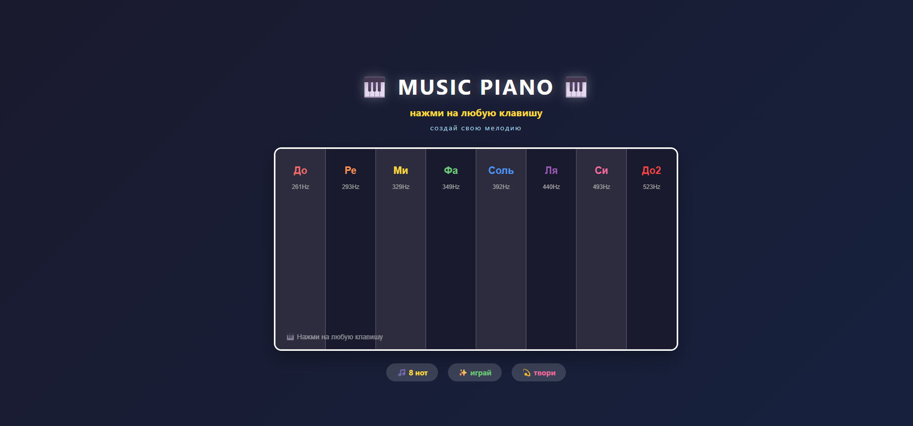
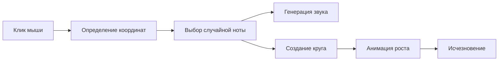

<div align="center">

# 🎵 MUSIC PIANO

### Интерактивная музыкальная визуализация в браузере

[](https://developer.mozilla.org/en-US/docs/Web/JavaScript)
[](https://html.spec.whatwg.org/)
[](https://www.w3.org/Style/CSS/)

</div>

---

## ✨ О проекте
## UPDATE 1.1 практически все переделано, но выглядит красивее и более функционально.
**MUSIC PIANO** - это минималистичный, но завораживающий веб-эксперимент, который превращает обычные клики мыши в музыкально-цветовое шоу. Каждый клик создаёт цветной круг, который растёт и исчезает под звуки музыкальной ноты.

## 📁 Структура проекта
```bash
music-circles/
│
├── 📄 index.html          # Главная страница
├── 🎨 style.css           # Стили и оформление  
├── ⚡ script.js           # JavaScript логика
├── 📖 README.md           # Документация проекта
└── 📂 img/
    └── 🖼️ image copy.png       # Превью/скриншот проекта
```
## 📸 Скриншоты

| Главный экран |
|---------------|
|  |

### 🎯 Особенности

| Особенность | Описание |
|-------------|----------|
| 🎨 **8 цветов радуги** | Каждая нота имеет свой уникальный цвет |
| 🎵 **8 музыкальных нот** | До, Ре, Ми, Фа, Соль, Ля, Си, До2 |
| 💫 **Плавная анимация** | Круги красиво растут и исчезают |
| 🖱️ **Интуитивное управление** | Просто кликни мышкой в любом месте |
| 📱 **Адаптивный дизайн** | Работает на любых устройствах |
| 🔊 **Настоящий звук** | Генерация синусоидальных волн |

---

## 🎮 Как это работает


```🎨 Визуальное соответствие
Нота	Цвет	HEX	Частота
До	🔴 Красный	#FF4444	261 Hz
Ре	🟠 Оранжевый	#FF8844	293 Hz
Ми	🟡 Жёлтый	#FFDD44	329 Hz
Фа	🟢 Зелёный	#44FF44	349 Hz
Соль	🔵 Голубой	#44DDFF	392 Hz
Ля	🔵 Синий	#4444FF	440 Hz
Си	🟣 Фиолетовый	#AA44FF	493 Hz
```
🛠️ Технические детали
Используемые технологии
```javascript
// Web Audio API - для генерации звука
const audioContext = new AudioContext();
const oscillator = audioContext.createOscillator();

// Canvas API - для отрисовки графики
const canvas = document.getElementById('canvas');
const ctx = canvas.getContext('2d');

// requestAnimationFrame - для плавной анимации
requestAnimationFrame(animate);
```
```bash
🚀 Быстрый старт
Установка
bash
# Клонируй репозиторий
git clone https://github.com/yourusername/music-circles.git

# Перейди в папку проекта
cd music-circles

# Открой в браузере
open index.html     # macOS
start index.html    # Windows
xdg-open index.html # Linux
Запуск с Live Server (рекомендуется)
bash
# Установи Live Server глобально
npm install -g live-server

# Запусти сервер
live-server
```
💻 Код в деталях
Основные компоненты
<details> <summary><b>🎵 Генерация звука</b> (нажми, чтобы раскрыть)</summary>
    
    ```javascript
    function playSound(frequency) {
    const oscillator = audioContext.createOscillator();
    const gain = audioContext.createGain();
    oscillator.type = "sine";
    oscillator.frequency.value = frequency;
    gain.gain.value = 0.3; 
    oscillator.connect(gain);
    gain.connect(audioContext.destination);
    oscillator.start();
    oscillator.stop(audioContext.currentTime + 0.3);


</details><details> <summary><b>⚪ Класс Circle</b></summary>
    
    ```javascript
    
    class Circle {
    constructor(x, y, note) {
        this.x = x;           // позиция X
        this.y = y;           // позиция Y
        this.note = note;     // объект ноты
        this.size = 10;       // начальный размер
        this.opacity = 1;     // начальная прозрачность
    }
    update() {
        this.size += 3;       // рост круга
        this.opacity -= 0.02; // исчезновение
    }
     }
    </details>
